<p align="center">
  
</p>

<h1 align="center">i-have-dyslexia</h1>

<p align="center">
  <strong>Dyslexic people spend their lives finding another way.<br/>This skill teaches Claude to do the same.</strong>
</p>

<p align="center">
  <a href="LICENSE"></a>
  
  
  <a href="https://mvdypsis.github.io/i-have-dyslexia/"></a>
</p>

<p align="center">
  <b>English</b> · <a href="README.pt-PT.md">Português</a>
</p>

<p align="center">
  
</p>

<p align="center">
  <b>No dyslexia needed.</b> If you get stuck, this is for you too.
</p>

---

## Install in one sentence

Paste this into Claude Code, or any coding agent:

```text
Install the i-have-dyslexia skill/plugin from https://github.com/mvdypsis/i-have-dyslexia, refer to the repo's AGENTS.md for instructions.
```

Then type **`/i-have-dyslexia setup`**. Claude asks you 5 questions, one at a time, and remembers how you like to work.

After that it switches on by itself in every session. Say **"stop dyslexia mode"** to pause it.

Also works in the Claude app, Codex, Gemini CLI and Cursor: see [INSTALL.md](INSTALL.md).

<p align="center">
  <a href="https://mvdypsis.github.io/i-have-dyslexia/"><b>🧭 Not sure where to start? Find your strategy in 10 seconds ➜</b></a>
</p>

---

## Two things it does

### 1. Claude thinks like a dyslexic thinker

Many dyslexic people see the big picture, think in pictures, and find paths others miss.
Those strategies are collected here, from dyslexic people, books and public interviews.
Claude uses them when **anyone** is stuck.

### 2. Claude works the way dyslexic people say helps

- The answer first, no walls of text.
- No red pen on your spelling.
- Ideas as pictures, and one step at a time.

---

## 25 ways dyslexic people think

<picture>
  <source media="(prefers-color-scheme: dark)" srcset="assets/strategy-map-dark.svg">
  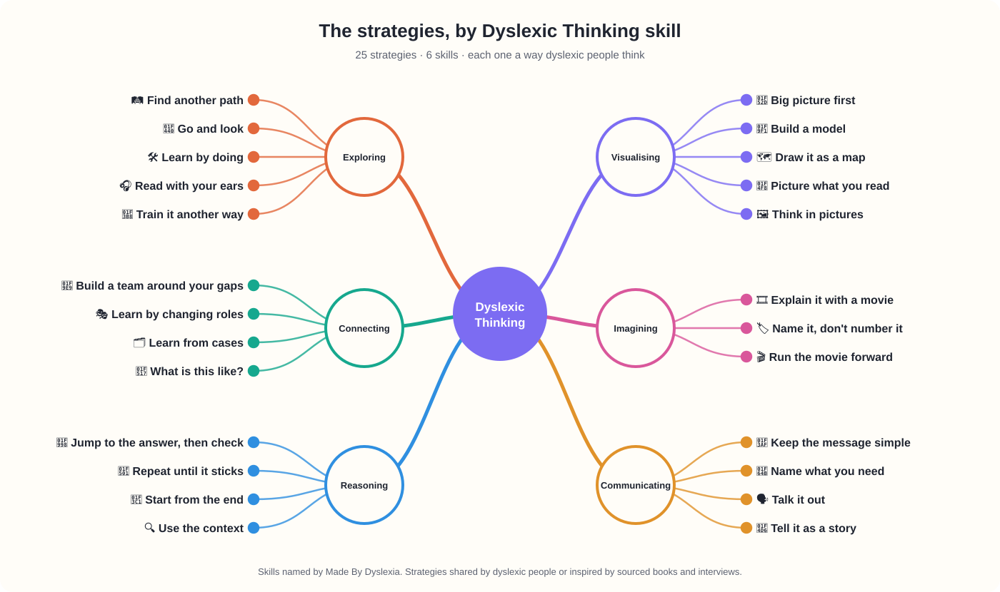
</picture>

Claude picks **one** strategy, tells you which, and does it **with** you.

<details>
<summary><b>See every strategy as a card</b></summary>
<br/>

<!-- cards:start (generated by tools/build-visuals.py, do not edit by hand) -->
<p align="center">
<a href="skills/i-have-dyslexia/strategies/big-picture-first.md"><picture><source media="(prefers-color-scheme: dark)" srcset="assets/cards/big-picture-first-dark.svg">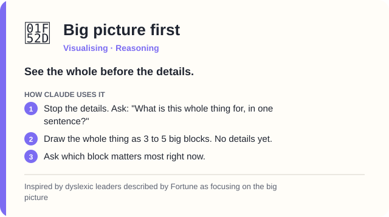</picture></a>
<a href="skills/i-have-dyslexia/strategies/build-a-model.md"><picture><source media="(prefers-color-scheme: dark)" srcset="assets/cards/build-a-model-dark.svg">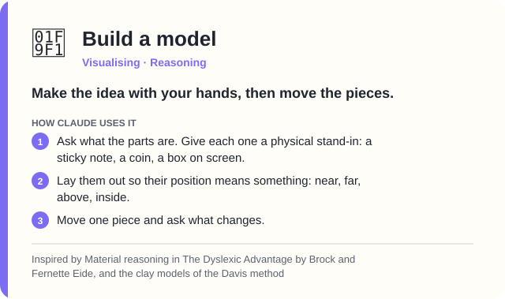</picture></a>
<a href="skills/i-have-dyslexia/strategies/draw-it-as-a-map.md"><picture><source media="(prefers-color-scheme: dark)" srcset="assets/cards/draw-it-as-a-map-dark.svg">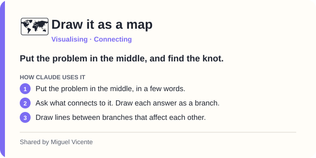</picture></a>
<a href="skills/i-have-dyslexia/strategies/picture-what-you-read.md"><picture><source media="(prefers-color-scheme: dark)" srcset="assets/cards/picture-what-you-read-dark.svg">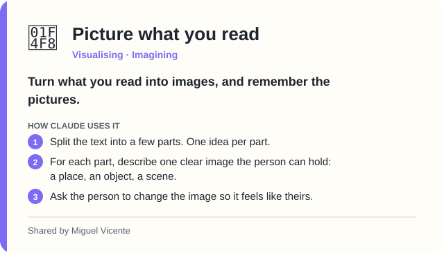</picture></a>
<a href="skills/i-have-dyslexia/strategies/think-in-pictures.md"><picture><source media="(prefers-color-scheme: dark)" srcset="assets/cards/think-in-pictures-dark.svg">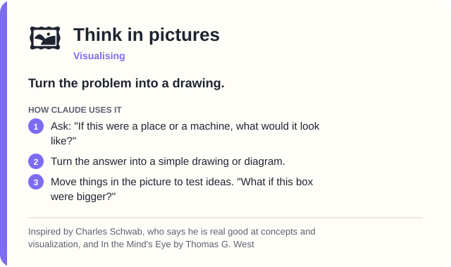</picture></a>
<a href="skills/i-have-dyslexia/strategies/explain-it-with-a-movie.md"><picture><source media="(prefers-color-scheme: dark)" srcset="assets/cards/explain-it-with-a-movie-dark.svg">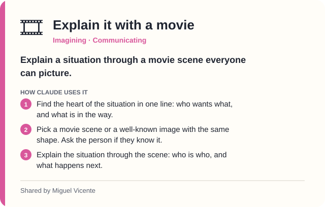</picture></a>
<a href="skills/i-have-dyslexia/strategies/name-it-dont-number-it.md"><picture><source media="(prefers-color-scheme: dark)" srcset="assets/cards/name-it-dont-number-it-dark.svg">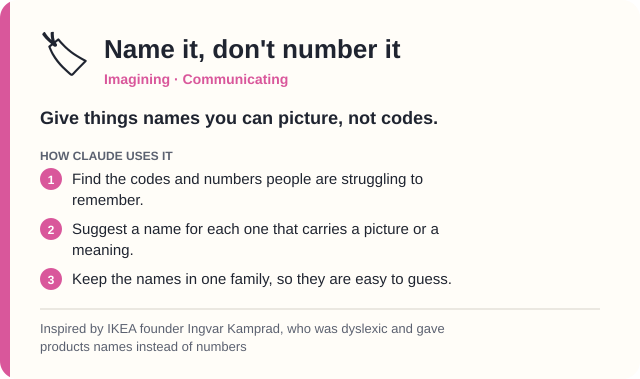</picture></a>
<a href="skills/i-have-dyslexia/strategies/run-the-movie-forward.md"><picture><source media="(prefers-color-scheme: dark)" srcset="assets/cards/run-the-movie-forward-dark.svg">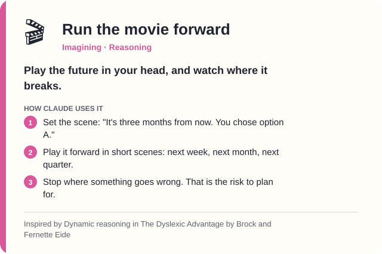</picture></a>
<a href="skills/i-have-dyslexia/strategies/keep-the-message-simple.md"><picture><source media="(prefers-color-scheme: dark)" srcset="assets/cards/keep-the-message-simple-dark.svg">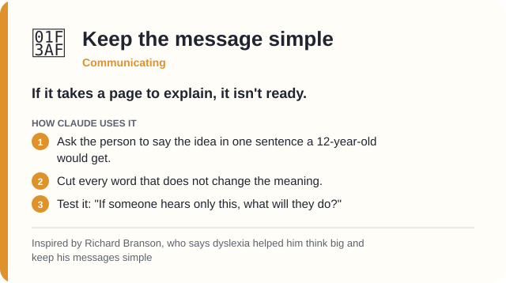</picture></a>
<a href="skills/i-have-dyslexia/strategies/name-what-you-need.md"><picture><source media="(prefers-color-scheme: dark)" srcset="assets/cards/name-what-you-need-dark.svg">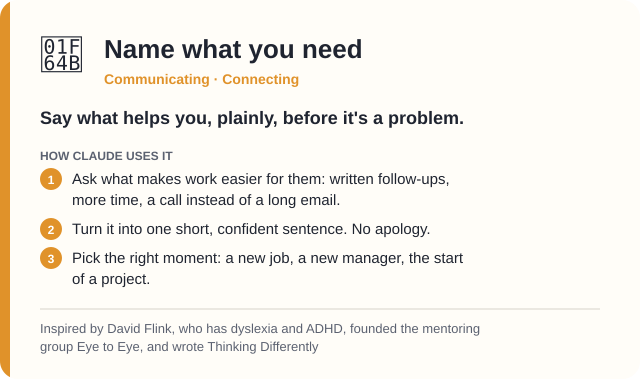</picture></a>
<a href="skills/i-have-dyslexia/strategies/talk-it-out.md"><picture><source media="(prefers-color-scheme: dark)" srcset="assets/cards/talk-it-out-dark.svg">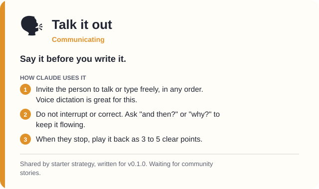</picture></a>
<a href="skills/i-have-dyslexia/strategies/tell-it-as-a-story.md"><picture><source media="(prefers-color-scheme: dark)" srcset="assets/cards/tell-it-as-a-story-dark.svg">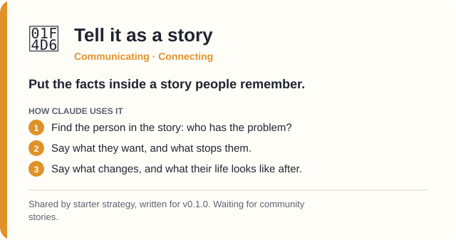</picture></a>
<a href="skills/i-have-dyslexia/strategies/jump-to-the-answer-then-check.md"><picture><source media="(prefers-color-scheme: dark)" srcset="assets/cards/jump-to-the-answer-then-check-dark.svg">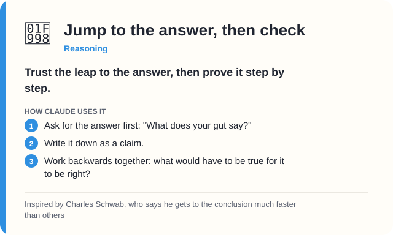</picture></a>
<a href="skills/i-have-dyslexia/strategies/repeat-until-it-sticks.md"><picture><source media="(prefers-color-scheme: dark)" srcset="assets/cards/repeat-until-it-sticks-dark.svg">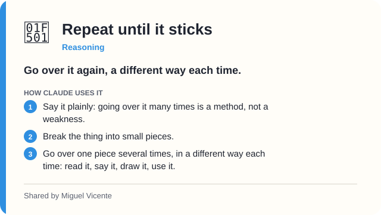</picture></a>
<a href="skills/i-have-dyslexia/strategies/start-from-the-end.md"><picture><source media="(prefers-color-scheme: dark)" srcset="assets/cards/start-from-the-end-dark.svg">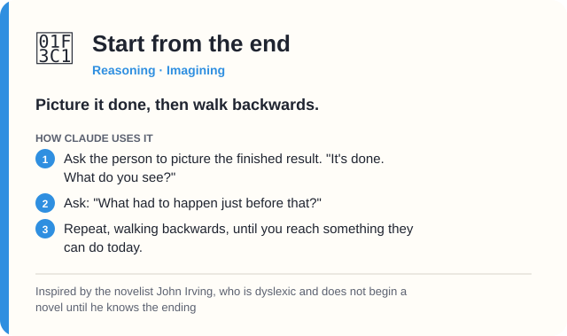</picture></a>
<a href="skills/i-have-dyslexia/strategies/use-the-context.md"><picture><source media="(prefers-color-scheme: dark)" srcset="assets/cards/use-the-context-dark.svg">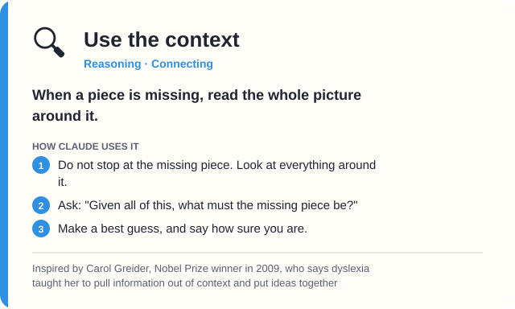</picture></a>
<a href="skills/i-have-dyslexia/strategies/build-a-team-around-your-gaps.md"><picture><source media="(prefers-color-scheme: dark)" srcset="assets/cards/build-a-team-around-your-gaps-dark.svg">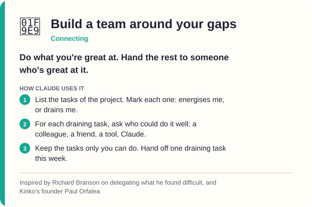</picture></a>
<a href="skills/i-have-dyslexia/strategies/learn-by-changing-roles.md"><picture><source media="(prefers-color-scheme: dark)" srcset="assets/cards/learn-by-changing-roles-dark.svg">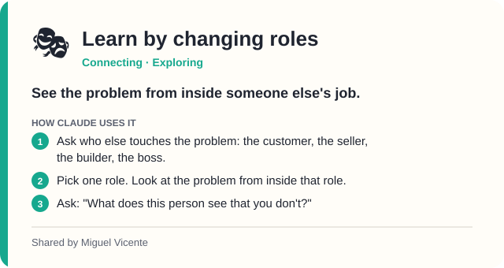</picture></a>
<a href="skills/i-have-dyslexia/strategies/learn-from-cases.md"><picture><source media="(prefers-color-scheme: dark)" srcset="assets/cards/learn-from-cases-dark.svg">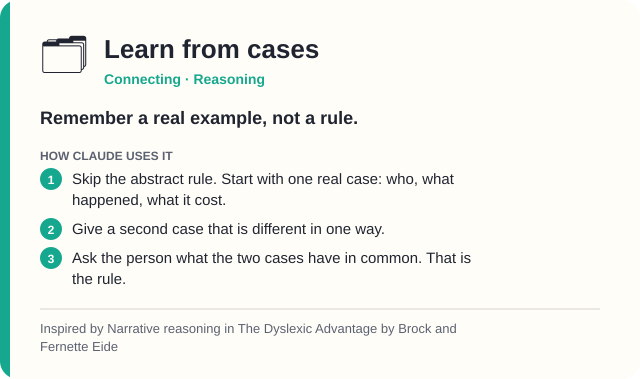</picture></a>
<a href="skills/i-have-dyslexia/strategies/what-is-this-like.md"><picture><source media="(prefers-color-scheme: dark)" srcset="assets/cards/what-is-this-like-dark.svg">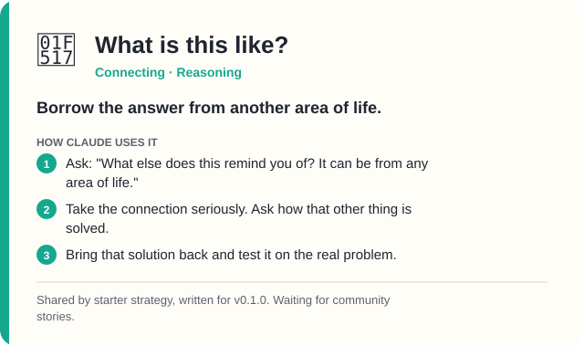</picture></a>
<a href="skills/i-have-dyslexia/strategies/find-another-path.md"><picture><source media="(prefers-color-scheme: dark)" srcset="assets/cards/find-another-path-dark.svg">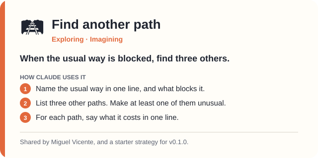</picture></a>
<a href="skills/i-have-dyslexia/strategies/go-and-look.md"><picture><source media="(prefers-color-scheme: dark)" srcset="assets/cards/go-and-look-dark.svg">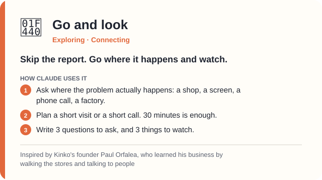</picture></a>
<a href="skills/i-have-dyslexia/strategies/learn-by-doing.md"><picture><source media="(prefers-color-scheme: dark)" srcset="assets/cards/learn-by-doing-dark.svg">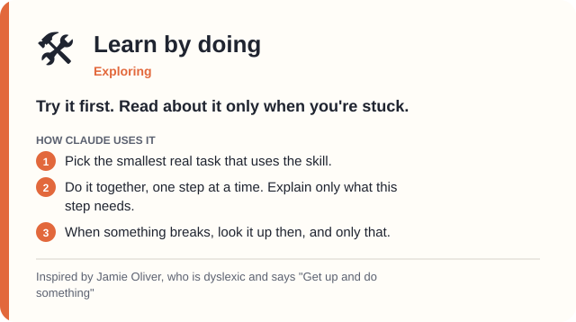</picture></a>
<a href="skills/i-have-dyslexia/strategies/read-with-your-ears.md"><picture><source media="(prefers-color-scheme: dark)" srcset="assets/cards/read-with-your-ears-dark.svg">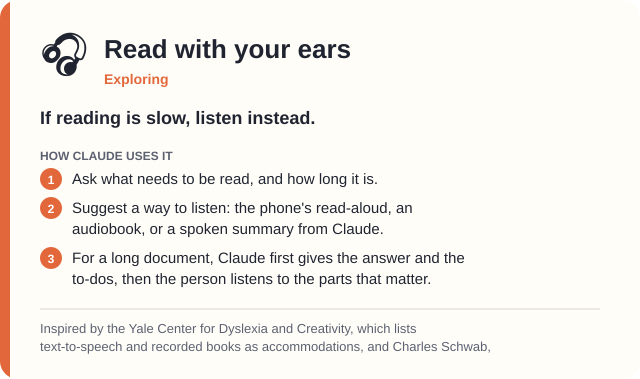</picture></a>
<a href="skills/i-have-dyslexia/strategies/train-it-another-way.md"><picture><source media="(prefers-color-scheme: dark)" srcset="assets/cards/train-it-another-way-dark.svg">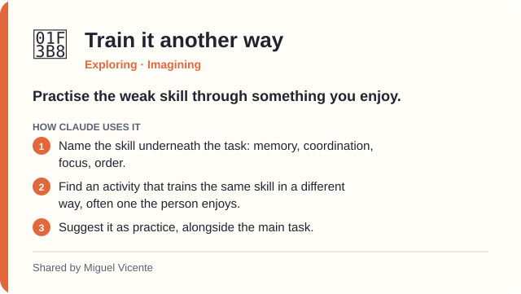</picture></a>
</p>
<!-- cards:end -->

</details>

They come from dyslexic people who shared them, and from **[the best dyslexic thinkers and books](READING-LIST.md)**.
IKEA's Ingvar Kamprad, Richard Branson, Charles Schwab, Nobel winner Carol Greider, John Irving, Jamie Oliver, and more.
Every source is linked and checked.

**This map grows.** The empty spaces are for your strategy. 👇

---

## Share how you think

A skill does not retrain Claude. It is a set of instructions Claude reads and follows.
So the way to teach Claude is to write down how great dyslexic thinkers work.

<p align="center">
  <a href="https://github.com/mvdypsis/i-have-dyslexia/issues/new?template=share-a-strategy.yml"><b>➜ Share a strategy</b></a>
  &nbsp;·&nbsp;
  <a href="https://github.com/mvdypsis/i-have-dyslexia/issues/new?template=what-helped.yml">It helped</a>
  &nbsp;·&nbsp;
  <a href="https://github.com/mvdypsis/i-have-dyslexia/issues/new?template=what-did-not-help.yml">It got in the way</a>
</p>

1. You fill in a short form. No code, no git. **Spelling does not matter.**
2. We write it up together, and you check the wording.
3. It joins the library with your name, and Claude uses it to help the next person.

More in [CONTRIBUTING.md](CONTRIBUTING.md).

---

## See the difference

<table>
<tr>
<th width="50%">Without the skill</th>
<th width="50%">With the skill</th>
</tr>
<tr>
<td>

> **"Help me get more people into my bakery. Flyers and Instagram didn't work."**
>
> Here are 12 ideas to grow foot traffic: 1. Run a loyalty program. 2. Partner with local businesses. 3. Host events. 4. Improve your Google listing. 5. Try TikTok. 6. Offer discounts...

</td>
<td>

> Let's try **Find another path**.
>
> Flyers and Instagram both try to reach strangers. The other path: start from the people who already come.
>
> Ask 5 regulars this week: "How did you first find us?"
>
> What do you think they'll say?

</td>
</tr>
<tr>
<td>

> **"why is my build failing"**
>
> The reason the build is failing is because the configuration file that the deployment pipeline relies on, which was updated in the most recent commit, contains a reference to an environment variable that has not yet been defined in the staging environment, so you'll need to add it there before re-running.

</td>
<td>

> **The build fails because a setting is missing in staging.**
>
> 1. The last change added a new setting: `API_KEY`.
> 2. Staging does not have `API_KEY` yet.
> 3. Add `API_KEY` to staging, then run the build again.

</td>
</tr>
<tr>
<td>

> **"fix this for my landlord: the boiler is brokan agian since wenesday"**
>
> Here's the corrected version. Note: "brokan" should be "broken", "agian" should be "again", and "wenesday" should be "Wednesday".

</td>
<td>

> Here's the message:
>
> Hi Mr Santos, the boiler has been broken again since Wednesday, and there's no hot water. Could you send someone this week?

</td>
</tr>
</table>

More pairs in [`examples/`](examples/).

---

## Try these

Copy any of these into Claude once the skill is on:

| Say this | What happens |
|---|---|
| **"I'm stuck. Draw it as a map."** | Your problem in the middle, the knot found. |
| **"Where am I?"** | A recap card: what's done, and ▶ what's next. |
| **"Break it down."** | Small steps of 15 minutes. Only the next 3 shown. |
| **"Help me write this."** | You say it your way. Claude gives it back clean. |
| **"What does this want from me?"** | A long document becomes the answer, then a to-do list. |
| **"Help me get better."** | Your 3 most common spelling patterns, with a memory trick each. |

---

## The principles

Strategies are what you do. Principles are why you keep going.

When someone fails, feels slow, or wants to give up, Claude uses **one** of these, in one line, then helps with the next step. No speeches.

> **Start from love** · **Do your best** · **Learn to love what you do** · **Be curious** · **Learn from the best** · **Discipline and determination** · **Never give up** · **Balance**

Shared by the founder. Full text in [`principles.md`](skills/i-have-dyslexia/principles.md).

---

## Writing in English and Portuguese

- **The right variety.** Portuguese means Portugal unless you say Brazil. English follows yours, UK or US.
- **Your voice stays.** A quick message stays quick.
- **Get better, if you want.** Ask, and Claude shows your 3 most common patterns. Never a list of every mistake.
- **Your tricky words.** Claude can keep a short list, so it understands you faster.

---

## Does it work?

Every change is tested by running Claude **with and without** the skill on the same requests, using `claude plugin eval`.
These are the real results for v0.3.0, failures included.

| Test | With | Without |
|---|---|---|
| Stuck: "see it from a different angle" | **1.00** | 0.00 |
| Learning: "a different way to approach this" | **1.00** | 0.00 |
| Fix a message, no spelling comments | **1.00** | 0.50 |
| Plan my week, with one clear first step | **0.50 to 1.00** | 0.00 |
| Show a comparison as a picture | **0.75** | 0.50 |
| Summarise a long email | 1.00 | 1.00 |
| Write in European Portuguese | 1.00 | 1.00 |
| Answer short when there is "too much text" | 1.00 | 1.00 |
| Setup asks one question at a time | **1.00** | 0.00 |
| Offers to draft a strategy that worked | **0.50** | 0.00 |

The skill switched on every time it should.
Planning moves between runs, and the comparison picture is not always small enough. Help is welcome.

The test cases are in [`evals/`](evals/). The skill's own text is checked by [`tools/check-readability.py`](tools/check-readability.py), because a skill about clear writing must follow its own rules.

---

## The 10 rules

<details>
<summary><b>How Claude writes for a dyslexic reader</b></summary>
<br/>

1. Answer first.
2. One idea per sentence.
3. Short paragraphs.
4. Plain words.
5. Same thing, same name.
6. Structure that guides the eye.
7. No spelling comments.
8. Offer a picture.
9. End long answers with "In short".
10. Warm, never patronising.

Full text in [SKILL.md](skills/i-have-dyslexia/SKILL.md).
</details>

---

## Questions

<details>
<summary><b>Do I need to be dyslexic?</b></summary>
<br/>
No. The strategies help anyone who is stuck. The reading and writing rules switch on when you say you are dyslexic, or ask for them.
</details>

<details>
<summary><b>Does this train Claude?</b></summary>
<br/>
No. A skill is a set of instructions Claude reads. When the library grows, everyone who updates the skill gets the new strategies.
</details>

<details>
<summary><b>Is anything I write sent to this project?</b></summary>
<br/>
No. The skill runs inside your own Claude. Nothing reaches this repo unless you choose to fill in a form.
</details>

<details>
<summary><b>What if a rule doesn't work for me?</b></summary>
<br/>
Tell Claude, in plain words: "shorter", "no diagrams", "just do it". Your words beat the skill. Then tell us, so the next version is better.
</details>

---

## Credits

- The six **Dyslexic Thinking** skills are named by [Made By Dyslexia](https://www.madebydyslexia.org/).
- Strategies inspired by books and public figures are listed with their sources in [READING-LIST.md](READING-LIST.md).
- The shape of this repo is inspired by [i-have-adhd](https://github.com/ayghri/i-have-adhd).
- Started by [Miguel Vicente](https://github.com/mvdypsis), who is dyslexic. The principles, and the strategies with his name, are his.

## Licence

[MIT](LICENSE). Use it, copy it, change it, share it.

<p align="center">
  ⭐ <b>Star it if Claude found you another path.</b>
</p>
