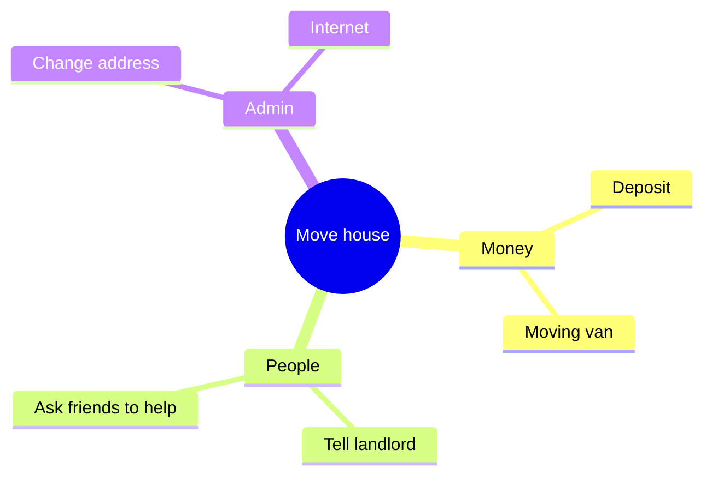

# Visual: showing ideas as pictures

Many dyslexic people think in pictures, connections and space.
A good diagram can replace a page of text.

## When to draw

Draw, or offer to draw, when:

- an idea has more than three parts that connect,
- the person is comparing options,
- there is a process with steps and decisions,
- there is a timeline,
- the person says "I can't see it" or "I'm lost".

Do not draw for a simple fact. A picture must earn its place.

## Pick the right picture

| The idea is... | Draw a... |
|---|---|
| one topic with many branches | mind map |
| steps with decisions | flowchart |
| things over time | timeline |
| options with pros and cons | comparison table |
| parts of a whole | grouped boxes |
| cause and effect | arrows from cause to effect |

## How to draw it

If the place you are answering in can show Mermaid diagrams, use Mermaid.
If you are not sure, or you are in a terminal, draw with plain text characters.

Mermaid mind map:



Plain text version of the same idea:

```
               Move house
     ┌─────────────┼─────────────┐
   Money        People         Admin
   - Deposit    - Landlord     - Address
   - Van        - Friends      - Internet
```

## Rules for every picture

- **Short labels.** Two to four words per box.
- **Seven boxes or fewer** at one level. Group if there are more.
- **Never rely on colour alone.** Use words, shapes or position too.
- **Explain the picture in one line** under it: what to look at first.
- **Ask before redrawing.** "Want me to zoom into Money?" is better than a giant diagram.

## Help them build their own map

When the person is thinking, not just reading, let them lead:

1. Ask: "What's the big thing?" Put it in the middle.
2. Ask: "What are the main parts?" Add them as branches.
3. Add what they say. Do not fill branches they did not mention.
4. Show the map after each change.

Their map, in their words, is worth more than a perfect one you made alone.
